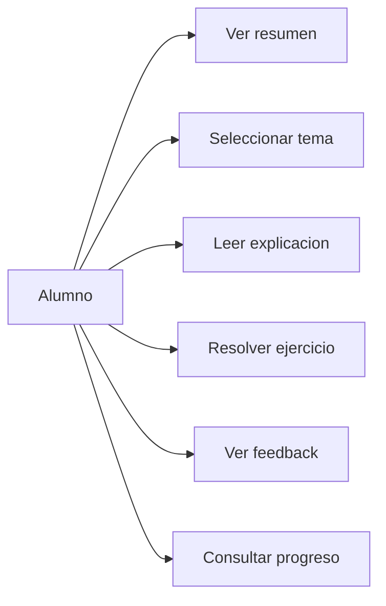
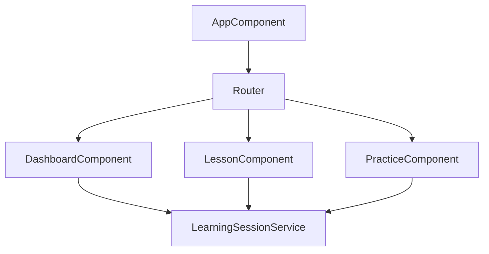
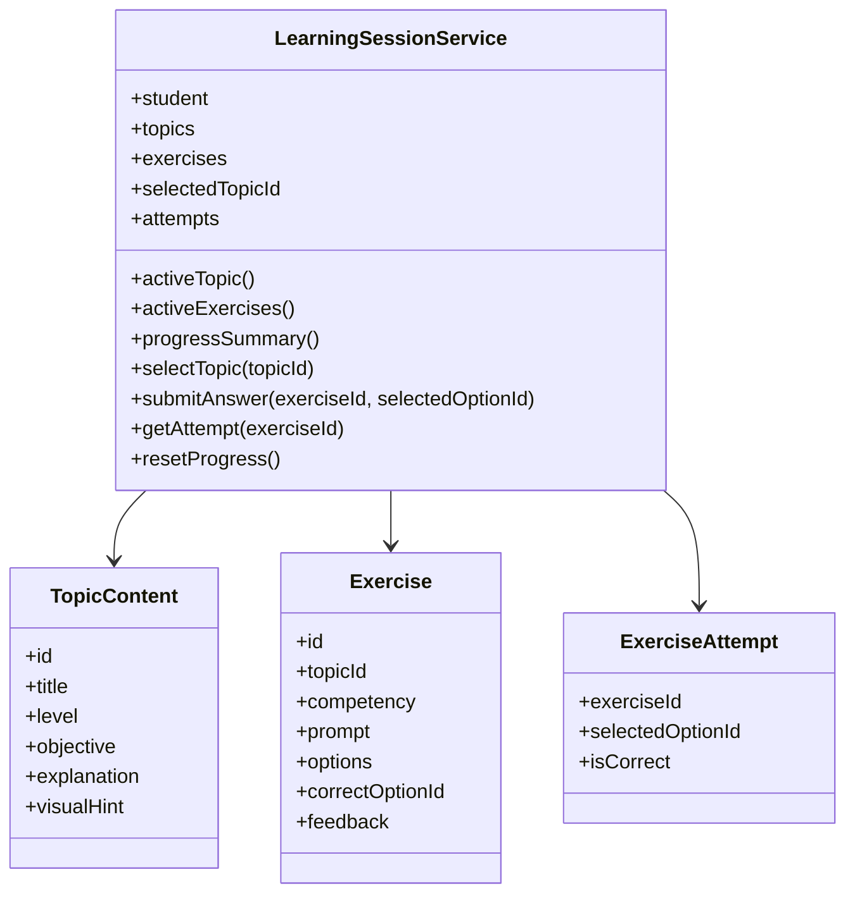
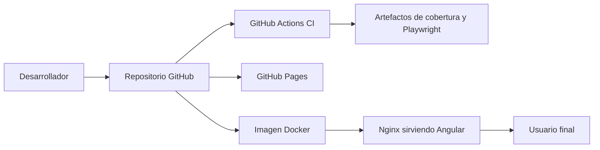
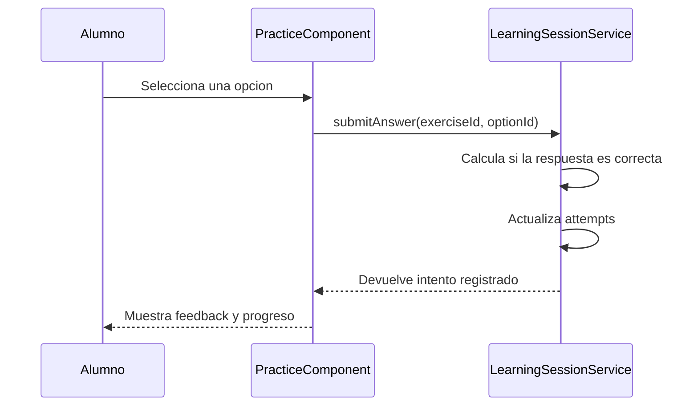
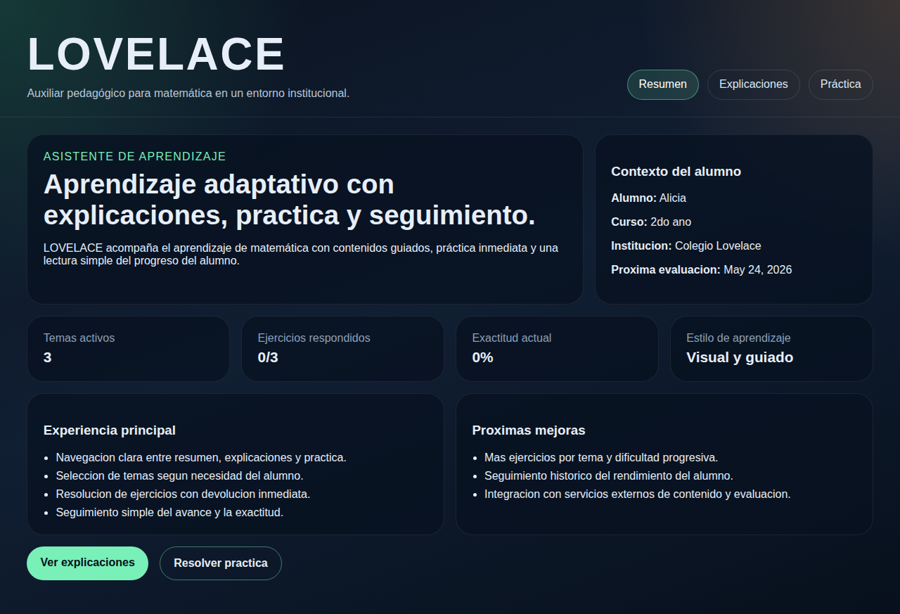
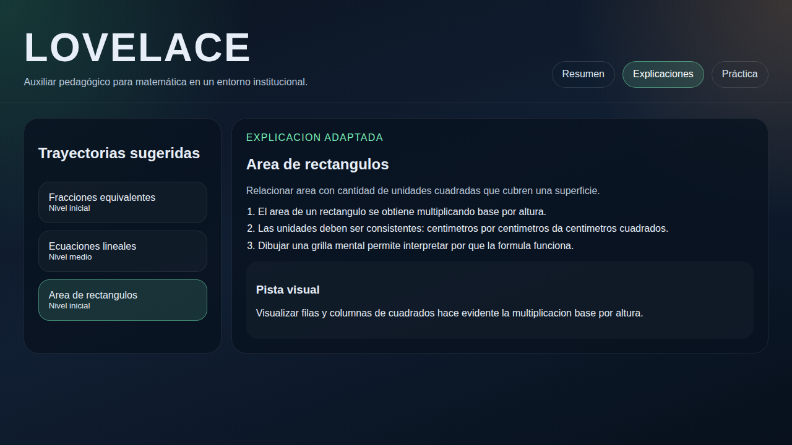
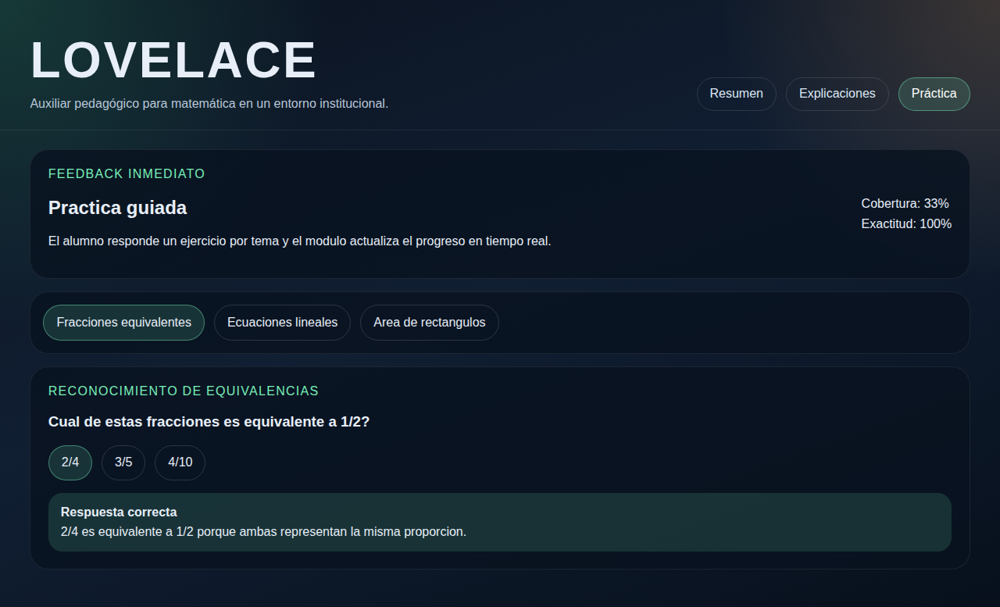

# Informe de entrega

## 1. Presentación general del proyecto

`LOVELACE` es una aplicación web desarrollada como trabajo final para demostrar integración entre desarrollo frontend, automatización de pruebas, cobertura, CI/CD y asistencia de IA en el ciclo de construcción de software.

La idea del proyecto fue construir un módulo educativo realista, acotado y demostrable. En lugar de presentar una interfaz estática, se diseñó una SPA orientada al aprendizaje de matemática con tres capacidades concretas:

- explicar contenidos por tema
- permitir práctica inmediata
- mostrar métricas simples de progreso y exactitud

La aplicación publicada se encuentra en:

- `https://juanmanuelcinto.github.io/lovelace-app/`

## 2. Problema que resuelve

El proyecto responde a una necesidad frecuente en entornos educativos: acompañar a un alumno con material breve, ejercicios focalizados y retroalimentación instantánea en una misma experiencia. La propuesta toma contenidos matemáticos introductorios y los organiza en una interfaz simple para demostrar:

- navegación clara entre vistas
- adaptación del contenido según tema seleccionado
- interacción con ejercicios de opción múltiple
- actualización del progreso en tiempo real
- posibilidad de validar calidad mediante pruebas automáticas

## 3. Objetivos del trabajo

- desarrollar un módulo funcional con valor pedagógico
- aplicar una arquitectura frontend mantenible y testeable
- incorporar pruebas unitarias y end-to-end
- medir cobertura sobre la lógica implementada
- automatizar validaciones con integración continua
- documentar el uso de IA dentro del proceso de desarrollo
- presentar diagramas, evidencia visual y criterios de seguridad

## 4. Alcance funcional implementado

La versión entregada incluye tres vistas principales:

- `Resumen`: presenta contexto del alumno, métricas y propuesta de valor del sistema
- `Explicaciones`: permite cambiar de tema y leer una explicación adaptada con objetivo y pista visual
- `Práctica`: habilita responder ejercicios, recibir feedback inmediato y actualizar el progreso

Temas cargados en la aplicación:

- fracciones equivalentes
- ecuaciones lineales
- área de rectángulos

## 5. Tecnología aplicada

### 5.1 Stack principal

- `Angular 19.2.x` para construir la SPA
- `TypeScript` para tipado estático y mantenimiento
- `Signals` y `computed` de Angular para manejar estado derivado
- `Karma + Jasmine` para pruebas unitarias
- `Playwright` para pruebas funcionales E2E y capturas
- `GitHub Actions` para CI/CD
- `Docker + Nginx` para empaquetado y despliegue estático
- `Mermaid` para expresar diagramas dentro del informe

### 5.2 Justificación técnica

Angular resultó adecuado porque permite separar claramente vistas, rutas y lógica de estado. La decisión de ubicar la lógica en `LearningSessionService` simplificó la testabilidad y evitó duplicación entre componentes. Playwright se incorporó para validar la experiencia del usuario completa, mientras que Karma/Jasmine cubren la lógica interna y el comportamiento de UI más puntual.

## 6. Desarrollo asistido con IA

La IA se utilizó como apoyo técnico durante el desarrollo, no como sustituto del criterio de implementación. Su aporte principal estuvo en acelerar tareas de diseño, revisión y documentación.

### 6.1 Tareas donde se aplicó IA

- definición inicial de la estructura de la SPA
- propuesta y refinamiento de casos de prueba
- revisión de cobertura y detección de ramas faltantes
- mejora de selectores de Playwright
- organización del pipeline de CI/CD
- redacción y ampliación de documentación técnica

### 6.2 Flujo de trabajo con IA

1. Se definió la idea funcional del módulo educativo.
2. Se usó IA para proponer una primera organización técnica.
3. Se revisó manualmente cada sugerencia antes de incorporarla.
4. Se ajustó el código para que los tests representaran escenarios reales.
5. Se validaron build, cobertura, E2E y documentación final con resultados concretos.

### 6.3 Criterio de uso responsable

- las decisiones finales fueron humanas
- no se incorporó código sin revisión
- la IA se usó para acelerar iteraciones, no para reemplazar validación
- toda la entrega fue contrastada con ejecución real del proyecto

## 7. Arquitectura de la solución

### 7.1 Estructura lógica

El sistema se organiza en una capa de estado y una capa de presentación:

- `LearningSessionService`: mantiene catálogo de temas, ejercicios, alumno y progreso
- `DashboardComponent`: resume el estado general
- `LessonComponent`: muestra explicaciones por tema
- `PracticeComponent`: administra resolución de ejercicios y feedback
- `app.routes.ts`: define la navegación entre vistas

### 7.2 Diagrama de casos de uso



### 7.3 Diagrama de componentes



### 7.4 Diagrama de clases simplificado



### 7.5 Diagrama de despliegue



### 7.6 Secuencia funcional principal



## 8. Estrategia de pruebas

Se aplicó una estrategia combinada para cubrir tanto lógica interna como flujo de usuario.

### 8.1 Pruebas unitarias

Cobertura de archivos clave:

- `AppComponent`
- `LearningSessionService`
- `PracticeComponent`

Escenarios probados:

- creación correcta de componentes
- render de navegación principal
- tema inicial seleccionado
- cambio de tema
- cálculo de progreso
- registro de respuestas
- feedback correcto e incorrecto

### 8.2 Pruebas funcionales E2E

Escenarios automatizados con Playwright:

- navegación desde inicio hasta práctica
- respuesta correcta y actualización de exactitud
- cambio de tema en explicaciones
- generación de capturas funcionales para evidencia

### 8.3 Resultados validados

Ejecución local comprobada:

```bash
npm run build
npm run test:coverage
npm run test:e2e
```

Resultados obtenidos el `12 de mayo de 2026`:

- `build`: correcto
- `unit tests`: `8/8` exitosos
- `E2E tests`: `3/3` exitosos luego de agregar la prueba de capturas
- `Statements`: `92.68%`
- `Branches`: `71.42%`
- `Functions`: `92.3%`
- `Lines`: `90.9%`

## 9. CI/CD implementado

Se dejaron configurados dos workflows dentro de `.github/workflows/`:

- `ci.yml`: instala dependencias, ejecuta cobertura, pruebas E2E, build y publica artefactos
- `pages.yml`: compila la app para GitHub Pages y despliega el sitio

El pipeline permite asegurar que cualquier cambio pase primero por validación automática antes de considerarse listo para publicar.

## 10. Seguridad implementada

Aunque se trata de una aplicación frontend estática y sin autenticación, se aplicaron medidas concretas para reducir superficie de riesgo.

### 10.1 Medidas en la aplicación

- uso de Angular con escape por defecto en plantillas
- ausencia de `innerHTML` o inyección manual de contenido sin sanitización
- datos locales tipados y controlados dentro del servicio
- sin credenciales embebidas ni secretos en frontend
- sin consumo de APIs externas en la versión entregada

### 10.2 Medidas en despliegue Nginx

Se configuraron headers HTTP:

- `Content-Security-Policy`
- `X-Frame-Options: DENY`
- `X-Content-Type-Options: nosniff`
- `Referrer-Policy: strict-origin-when-cross-origin`
- `Permissions-Policy` con cámara, micrófono y geolocalización deshabilitados

### 10.3 Medidas operativas

- `npm ci` para instalaciones reproducibles
- contenedor Nginx separado del proceso de build
- despliegue estático, lo que elimina lógica de backend expuesta en producción
- posibilidad de agregar HTTPS mediante reverse proxy o GitHub Pages

### 10.4 Riesgos residuales

- la aplicación no implementa autenticación porque no forma parte del alcance
- la cobertura de ramas puede seguir ampliándose
- GitHub Pages no permite trasladar exactamente el mismo esquema de headers que Nginx

## 11. Evidencia visual y capturas

### 11.1 Evidencia de GitHub y CI

- `docs/evidencia/01-repositorio-github.jpg`
- `docs/evidencia/02-workflow-success.jpg`
- `docs/evidencia/03-job-quality.jpg`
- `docs/evidencia/04-artifacts.jpg`

### 11.2 Capturas funcionales de la aplicación

Resumen:



Explicaciones:



Práctica con feedback:



Las capturas funcionales se generan automáticamente con:

```bash
npm run capture:evidence
```

## 12. Resultados del trabajo

El proyecto quedó completo en cinco dimensiones:

- producto funcional navegable
- arquitectura separada y mantenible
- pruebas automáticas con buena cobertura
- integración continua y publicación automatizable
- documentación suficiente para exposición académica

## 13. Conclusión

`LOVELACE` cumple con la consigna al integrar una idea funcional clara, una implementación técnica consistente y un proceso de calidad verificable. La combinación entre Angular, pruebas automatizadas, CI/CD y asistencia de IA permitió construir un entregable pequeño pero profesional, fácil de mostrar y defendible desde lo técnico.

Como evolución futura, el sistema podría incorporar autenticación, persistencia real, mayor variedad de ejercicios y analítica histórica del aprendizaje sin rehacer su base arquitectónica.
